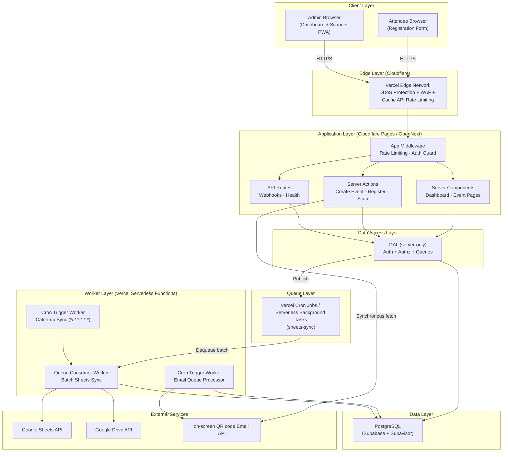

# FlowCheck — System Architecture

## 1. System Overview

FlowCheck is a zero-configuration, web-based event attendance system designed to operate on a $0/month free-forever stack. Non-technical administrative staff can create events, generate registration links, and scan attendees at the door using any phone or laptop camera. Attendance records are automatically synced to Google Sheets.

The architecture is entirely serverless and edge-native, leveraging Vercel for hosting the Next.js application, Supabase for PostgreSQL and authentication, and on-screen QR generation. This eliminates the need for persistent worker containers or paid hosting tiers.

Heavy background tasks—specifically, batch-syncing attendance data to Google Sheets without exceeding API rate limits—are handled natively by Vercel Cron Jobs / Serverless Background Tasks and Cloudflare Cron Triggers, providing enterprise-grade reliability at zero cost.

## 2. Architecture Diagram



## 3. Tech Stack

| Layer | Technology | Free Tier Limit | Rationale |
|---|---|---|---|
| Framework | Next.js 15 (App Router) | N/A | Industry standard, highly optimized for modern web apps. |
| Language | TypeScript (strict) | N/A | Prevents runtime errors, essential for rapid development. |
| Styling | Tailwind CSS v4 | N/A | Fast, utility-first styling. |
| Database | Supabase (PostgreSQL) | 500MB DB | Elite free tier. Includes Supavisor connection pooling. |
| ORM | Drizzle ORM | N/A | Lightweight, compiles to pure SQL for edge speeds. |
| Auth | Supabase Auth (Google OAuth) | 50K MAU | Zero config for Google login. Easy to debug in dashboard. |
| Email | on-screen QR code | 300 emails/day | 3x more emails than Resend's free tier. |
| Hosting | Cloudflare Pages (OpenNext) | Unlimited bandwidth, 100K Worker req/day | Zero cold starts, no commercial restrictions, generous free tier. |
| Background | Vercel Cron Jobs / Serverless Background Tasks | 1M ops/month | Native batching, replaces BullMQ/Redis. |
| Rate Limiting | Cloudflare WAF + Cache API | 1 WAF rule | Built-in DDoS protection. |
| Spreadsheets | Google Sheets API v4 | 60 req/min/user | The final ledger for administrative staff. |
| QR Gen | `qrcode` | N/A | Pure JS, edge-compatible (unlike `sharp`). |
| QR Scan | `html5-qrcode` | N/A | Supports both phone and laptop webcams. |
| PWA | Serwist | N/A | Modern service worker support for Next.js. |

## 4. Free Tier Limits & Practical Impact

| Service | Limit | Practical Impact |
|---|---|---|
| Cloudflare Pages | Unlimited bandwidth, 500 builds/mo | Effectively unlimited page loads. |
| Vercel Serverless Functions | 100,000 requests/day | Extremely generous. Supports ~100K API calls/day. |
| Vercel Serverless Functions CPU | 10ms CPU time/invocation | **Risk Area:** QR generation (~5ms) fits, but must be monitored. If it exceeds 10ms, QR generation moves to a Queue consumer. Network I/O does not count towards CPU time. |
| Vercel Cron Jobs / Serverless Background Tasks | 1,000,000 operations/month | ~33,000 queue messages/day. Plenty for syncing. |
| Supabase | 500MB DB, 50K MAU | Will comfortably hold >100,000 attendee records. |
| on-screen QR code | 300 emails/day | **Bottleneck:** Caps max registrations at ~290/day. |
| Google Sheets API | 60 requests/minute | Requires the batch sync architecture to stay under quota. |

*Note: The architecture scales up linearly by simply upgrading to a paid tier on any of these services. No code changes are required.*

## 5. Request Flow Summary

| Workflow | Request Path |
|---|---|
| **Event Creation** | Admin Browser → Edge WAF → App Middleware → Server Action → DAL → Supabase (INSERT) |
| **Event Publish** | Admin Browser → ... → Server Action → DAL → Supabase (UPDATE) + Google Sheets API (Sync) + Drive API (Share) |
| **Registration** | Attendee Browser → Edge WAF → App Middleware → Server Action → DAL → Daily Cap Check → QR Gen → on-screen QR code API (Sync or Queue) → Supabase (INSERT) |
| **Email Queue Sync** | Cloudflare Cron Trigger → Supabase (SELECT email_sent = false) → on-screen QR code API (Sync) → Supabase (UPDATE) |
| **QR Scan** | Admin PWA → Edge WAF → App Middleware → Server Action → DAL → Supabase (UPDATE) + Cloudflare Queue (Publish) |
| **Sheets Sync** | Cloudflare Queue Consumer (or Cron) → Supabase (SELECT) → Google Sheets API (Batch Update) |

## 6. Project Structure

```text
flowcheck/
├── public/                    # Static assets
│   ├── icons/                 # PWA icons
│   └── sounds/                # Scanner audio feedback
├── src/
│   ├── app/                   # App Router: Routing & Pages only
│   │   ├── (public)/          # Unauthenticated (Landing, Registration)
│   │   ├── (dashboard)/       # Authenticated (Events, Scanner, Settings)
│   │   ├── api/               # API Routes (Webhooks, Cron triggers)
│   │   ├── manifest.ts        # PWA manifest
│   │   ├── sw.ts              # Serwist service worker
│   │   └── layout.tsx         # Root layout
│   ├── actions/               # Server Actions (Thin wrappers)
│   ├── data/                  # Data Access Layer (import 'server-only')
│   ├── components/            # React Components
│   │   ├── ui/                # UI Primitives
│   │   ├── scanner/           # QR Scanner PWA components
│   │   ├── events/            # Event management UI
│   │   ├── registration/      # Registration forms
│   │   └── layout/            # Navigation, sidebars
│   ├── lib/                   # Utilities & Integrations
│   │   ├── db/                # Drizzle ORM config & schema
│   │   ├── auth/              # Supabase Auth helpers
│   │   ├── google/            # Sheets/Drive API clients
│   │   ├── qr/                # QR Code generation
│   │   ├── email/             # on-screen QR code fetch client
│   │   ├── queue/             # Cloudflare Queue producers
│   │   └── validators/        # Zod schemas
│   ├── hooks/                 # Custom React hooks
│   ├── types/                 # TypeScript type definitions
│   └── styles/                # Tailwind CSS globals
├── workers/                   # Cloudflare Queue Consumers & Crons
│   ├── sheets-sync.ts         # Handles batched Google Sheets updates
│   └── email-queue.ts         # Processes backlog of unsent emails
├── wrangler.toml              # Cloudflare configuration
├── open-next.config.ts        # OpenNext adapter configuration
├── drizzle.config.ts          # Database migration config
├── middleware.ts              # Edge routing & rate limiting
├── next.config.ts             # Next.js configuration
├── docker-compose.yml         # Local Postgres database
└── package.json
```

## 7. Key Architectural Decisions (ADRs)

- **ADR-1: Cloudflare Pages over Vercel.** Vercel's hobby tier restricts commercial use and limits bandwidth. Cloudflare Pages via OpenNext offers unlimited bandwidth, zero cold starts, and no commercial restrictions.
- **ADR-2: on-screen QR code over Resend.** on-screen QR code provides 300 emails/day on their free tier, compared to Resend's 100/day. This triples the daily registration capacity for a free-tier app.
- **ADR-3: Vercel Cron Jobs / Serverless Background Tasks over BullMQ/Upstash.** Vercel Cron Jobs / Serverless Background Tasks provides native batching (perfect for the Google Sheets API limit) and 1M free operations/month, eliminating the need for a separate Redis instance and a paid worker container.
- **ADR-4: Supabase Auth over NextAuth.** Supabase Auth is free, built-in, provides easy debugging via the Supabase dashboard, and integrates directly with PostgreSQL Row Level Security.
- **ADR-5: Drizzle ORM over Prisma.** Drizzle is lightweight, compiles to pure SQL, and is fully compatible with Edge runtimes (unlike Prisma's heavier Rust engine).
- **ADR-6: Pure JS QR Generation (No `sharp`).** Vercel Serverless Functions do not support native C++ modules like `sharp`. We use the `qrcode` library to generate a pure PNG buffer or SVG.

## 8. Scalability Strategy

The architecture handles increased load gracefully without code changes.

1. **Free Tier:** 100K requests/day, 290 emails/day, 33K queue ops/day.
2. **Growth ($14/mo):**
   - Vercel Serverless Functions Paid ($5/mo): 10M requests, 30ms CPU time.
   - on-screen QR code Starter ($9/mo): 5,000 emails/month (removes daily limit).
3. **Scale ($39/mo):**
   - Supabase Pro ($25/mo): 8GB Database, 100K MAU.

## 9. Dependency List

**Production:**
`next`, `react`, `react-dom`, `typescript`, `drizzle-orm`, `@supabase/supabase-js`, `@supabase/ssr`, `@opennextjs/cloudflare`, `qrcode`, `html5-qrcode`, `@serwist/next`, `serwist`, `googleapis`, `zod`, `tailwindcss`

**Development:**
`drizzle-kit`, `wrangler`, `@types/node`, `@types/react`, `eslint`, `prettier`, `vitest`, `playwright`

*(Note: No `ioredis`, `bullmq`, `sharp`, `@upstash/*`, or `resend`)*

## 10. Environment Variables

```bash
# Database (Supabase)
DATABASE_URL=                          # Supavisor pooled (port 6543)
DIRECT_DATABASE_URL=                   # Direct (port 5432, migrations only)
NEXT_PUBLIC_SUPABASE_URL=              # Client URL
NEXT_PUBLIC_SUPABASE_ANON_KEY=         # Client Key
SUPABASE_SERVICE_ROLE_KEY=             # Server-only Admin Key

# on-screen QR code (Email)
on-screen QR code_API_KEY=                         # on-screen QR code SMTP/API Key
EMAIL_FROM_NAME=FlowCheck
EMAIL_FROM_EMAIL=noreply@yourdomain.com

# Google Service Account
GOOGLE_SERVICE_ACCOUNT_EMAIL=          # Service account email
GOOGLE_SERVICE_ACCOUNT_PRIVATE_KEY=    # JSON private key

# App
NEXT_PUBLIC_APP_URL=https://flowcheck.pages.dev
CRON_SECRET=                           # To secure the cron endpoints

# Email Safety Cap
DAILY_EMAIL_LIMIT=290                  # Stays under on-screen QR code's 300/day limit
```
