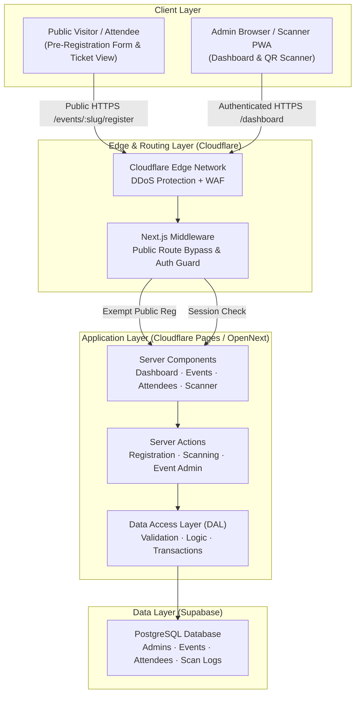

# FlowCheck — System Architecture

## 1. System Overview

FlowCheck is a zero-configuration, web-based event attendance and pre-registration system. Any public user can pre-register for open events without creating an account. Non-technical administrative staff can create events, manage teams, generate registration links, and scan attendee QR codes at the door using any smartphone or camera.

The architecture is serverless and edge-native, built with Next.js 16 (App Router) deployed via `@opennextjs/cloudflare` to Cloudflare Pages/Workers, Supabase for PostgreSQL database storage and Google OAuth authentication for event administrators, and client-side on-screen QR ticket generation with Web Audio API sound feedback for door staff.

All event metrics, registrations, attendee check-ins, and scan logs are stored in PostgreSQL with real-time analytics in the admin dashboard and CSV export capabilities.

## 2. Architecture Diagram


```mermaid
graph TB
    subgraph "Client Layer"
        A["Admin Browser / Scanner PWA<br/>(Dashboard & QR Scanner)"]
        B["Public Visitor / Attendee<br/>(Pre-Registration Form & Ticket View)"]
    end

    subgraph "Edge & Routing Layer (Cloudflare)"
        C["Cloudflare Edge Network<br/>DDoS Protection + WAF"]
        G["Next.js Middleware<br/>Public Route Bypass & Auth Guard"]
    end

    subgraph "Application Layer (Cloudflare Pages / OpenNext)"
        D["Server Components<br/>Dashboard · Events · Attendees · Scanner"]
        E["Server Actions<br/>Registration · Scanning · Event Admin"]
        H["Data Access Layer (DAL)<br/>Validation · Logic · Transactions"]
    end

    subgraph "Data Layer (Supabase)"
        I["PostgreSQL Database<br/>Admins · Events · Attendees · Scan Logs"]
    end

    B -->|Public HTTPS /events/:slug/register| C
    A -->|Authenticated HTTPS /dashboard| C
    C --> G
    G -->|Exempt Public Reg| D
    G -->|Session Check| D
    D --> E
    E --> H
    H --> I
```

## 3. Tech Stack

| Layer | Technology | Version | Rationale / Usage |
|---|---|---|---|
| Framework | Next.js (App Router) | `16.2.10` | Industry standard, serverless & edge runtime ready via OpenNext. |
| Core Library | React | `19.2.4` | Modern UI rendering and server components. |
| Language | TypeScript | `^5.0.0` (Strict) | End-to-end type safety. |
| Styling | Tailwind CSS | `^4.0.0` | Utility-first styling with PostCSS. |
| Database | Supabase (PostgreSQL) | PostgreSQL 15+ | Relational data, connection pooling (Supavisor). |
| ORM | Drizzle ORM | `^0.45.2` | Ultra-lightweight, edge-compatible SQL builder. |
| Auth | Supabase Auth (`@supabase/ssr`) | `^0.12.0` | Google OAuth and session management for Admins. |
| Deployment | Cloudflare Pages / Workers | OpenNext `^1.20.1` | Edge deployment with generous free tier and zero cold starts. |
| QR Generation | `qrcode` | `^1.5.4` | Pure JavaScript QR canvas/PNG generation. |
| QR Scanner | `html5-qrcode` | `^2.3.8` | Webcam QR scanning in mobile/desktop browser. |
| Sound System | Web Audio API | Native Browser | Zero external MP3 files; synthesizes clean audio chimes for success, warning, and error states. |
| PWA Support | Serwist (`@serwist/next`) | `^9.5.11` | Progressive Web App manifest and service worker. |

## 4. Key Architectural Decisions (ADRs)

- **ADR-1: Public Pre-Registration Bypass.** Any visitor can pre-register for an open event without creating a FlowCheck account. The middleware explicitly permits access to `/events/[slug]/register` while protecting `/dashboard` and administrative `/events` management routes.
- **ADR-2: Web Audio API over Audio Files.** Sound feedback in the QR Scanner is generated on-the-fly using browser `AudioContext` oscillators. This avoids network request delays, missing asset errors, or MIME-type loading issues across mobile devices.
- **ADR-3: OpenNext Cloudflare Deployment.** Uses `@opennextjs/cloudflare` to build Next.js 16 into a Cloudflare Pages/Worker bundle, eliminating cold starts and hosting cost.
- **ADR-4: On-Screen Immediate QR Ticket.** Attendees receive an immediate scan token upon registration, rendering their ticket QR code right on the web page with immediate download capability, alongside email lookup verification.
- **ADR-5: Drizzle ORM over Prisma.** Drizzle compiles directly to lightweight SQL queries without native binaries, making it optimal for serverless and edge environments.

## 5. Project Structure

```text
FlowCheck/
├── public/                    # Static public assets
│   └── images/                # Brand assets (flowcheck_logo_v2.png)
├── src/
│   ├── app/
│   │   ├── (dashboard)/       # Authenticated routes (Events, Attendees, Scanner)
│   │   │   ├── attendees/
│   │   │   ├── events/
│   │   │   └── scanner/
│   │   ├── (public)/          # Unauthenticated public routes
│   │   │   ├── events/[id]/register/
│   │   │   └── login/
│   │   ├── api/               # Next.js API routes
│   │   ├── globals.css        # Global styles & Tailwind
│   │   ├── layout.tsx         # Root layout
│   │   └── middleware.ts      # Authentication & route guards
│   ├── actions/               # Next.js Server Actions
│   │   ├── eventAdmins.ts
│   │   ├── events.ts
│   │   ├── registration.ts
│   │   └── scanner.ts
│   ├── components/            # UI Components
│   │   ├── attendees/         # Attendee dashboard & table view
│   │   ├── auth/              # Login & logout forms
│   │   ├── events/            # Event creation, team & link sharing
│   │   ├── layout/            # SidebarNav, DashboardShell, SystemInfoModal
│   │   └── scanner/           # QRScanner with Web Audio feedback
│   ├── data/                  # Server-side Data Access Layer (DAL)
│   │   ├── attendees.ts
│   │   ├── events.ts
│   │   ├── registration.ts
│   │   └── scanner.ts
│   └── lib/                   # Libraries, Database & Integrations
│       ├── db/                # Drizzle schema & database client
│       └── validators/        # Zod validation schemas
├── docs/                      # Technical documentation
├── drizzle.config.ts          # Drizzle ORM migration configuration
├── next.config.ts             # Next.js configuration
├── open-next.config.ts        # OpenNext adapter configuration
├── wrangler.toml              # Cloudflare Workers configuration
└── package.json
```

## 6. Environment Variables

```bash
# Database (Supabase / PostgreSQL)
DATABASE_URL=                          # Supavisor pooled connection (port 6543)
DIRECT_DATABASE_URL=                   # Direct Postgres connection (port 5432)
NEXT_PUBLIC_SUPABASE_URL=              # Supabase Project URL
NEXT_PUBLIC_SUPABASE_ANON_KEY=         # Supabase Anon Key
SUPABASE_SERVICE_ROLE_KEY=             # Server-only Service Role Key

# App Configuration
NEXT_PUBLIC_APP_URL=https://flowcheck.pages.dev
```
