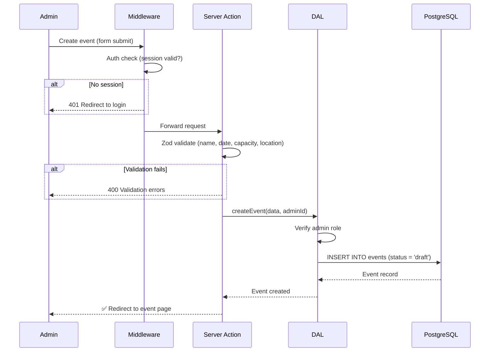
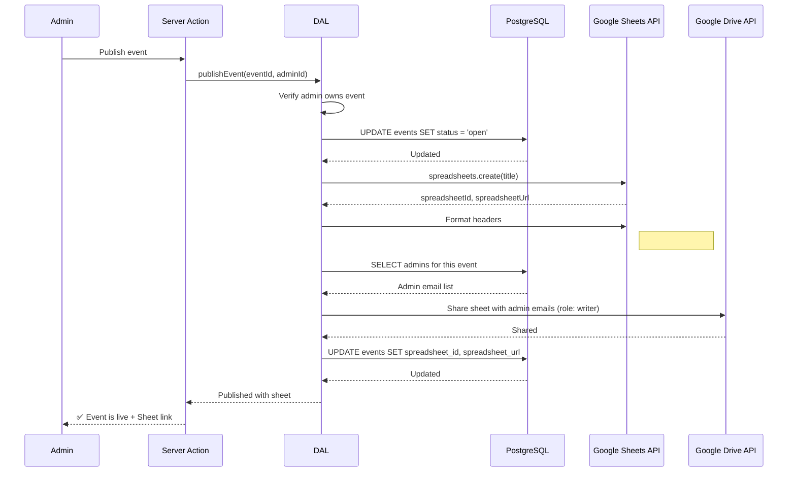
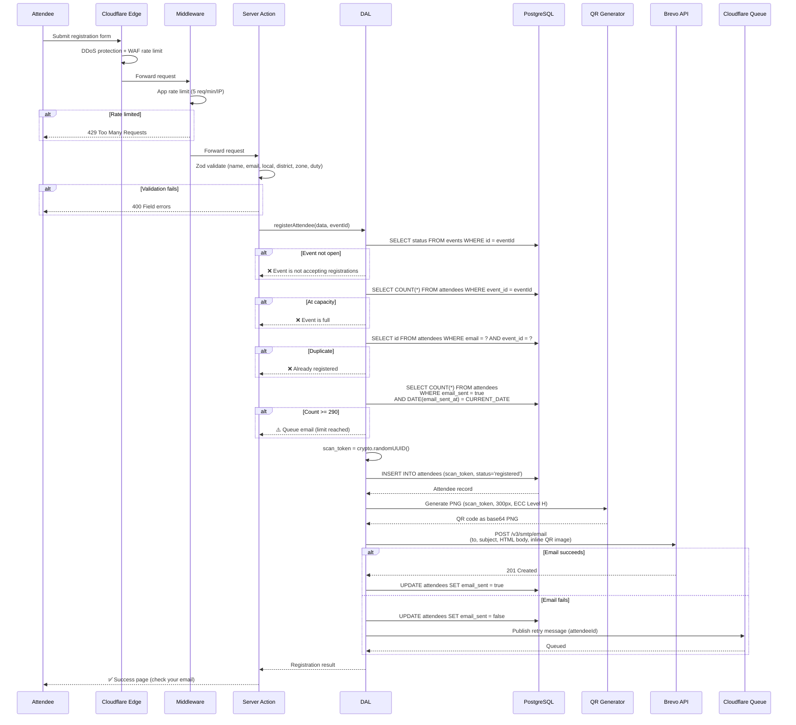
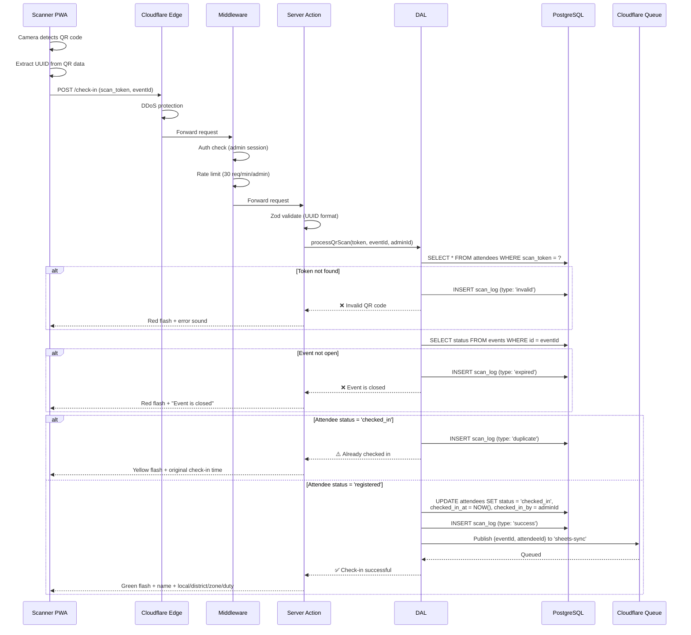
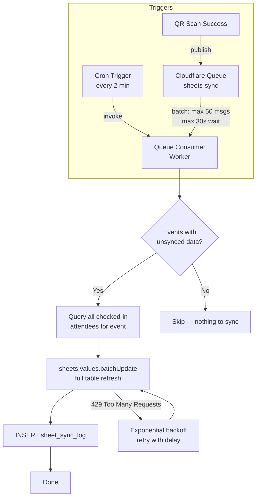
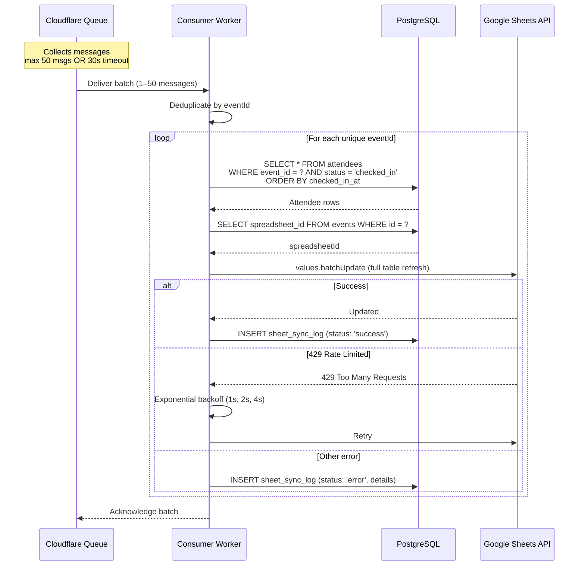
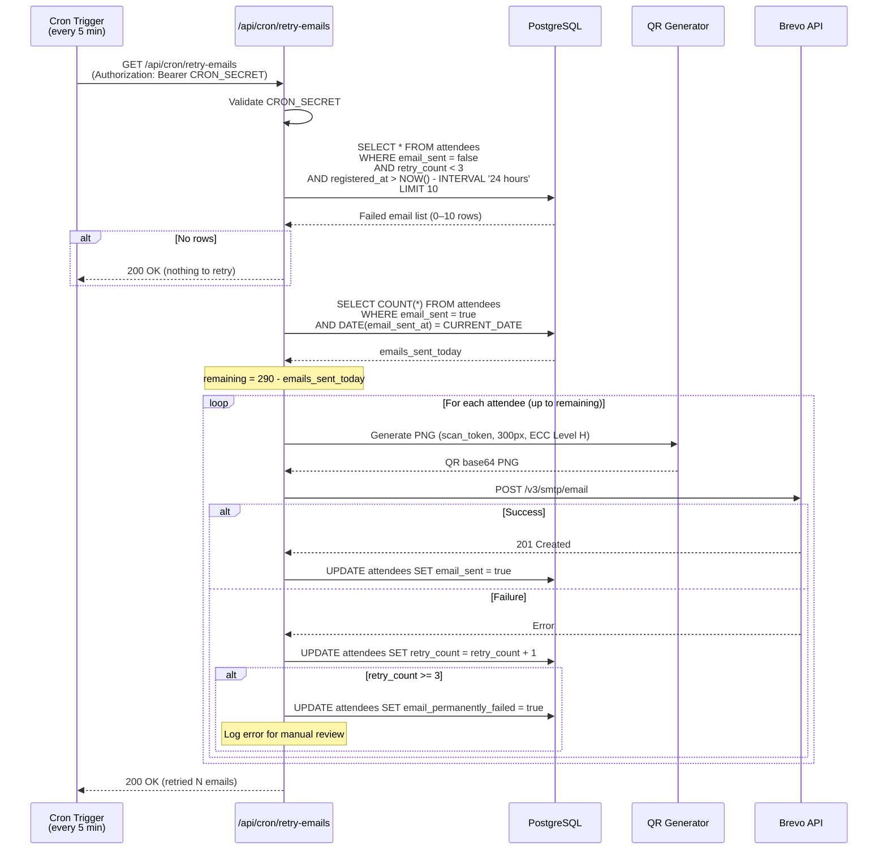
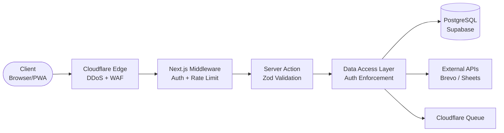

# Data Flows

This document describes every critical data path in FlowCheck — from event creation to email retries. Each flow includes a sequence diagram, step-by-step breakdown, error handling, and timing expectations.

> [!NOTE]
> All server-side operations use Next.js Server Actions with Zod validation. Database access goes through a Data Access Layer (DAL) that enforces auth checks before every query.

---

## Flow 1: Event Creation

An admin creates an event as a draft, then publishes it. Publishing triggers synchronous Google Sheets provisioning.

### Draft Creation

### Publishing (Draft → Open)

When an admin publishes an event, the system provisions a Google Sheet and shares it with all event admins. This is **synchronous** because event creation is infrequent and the admin expects immediate confirmation.

**Error handling:**
- If Google Sheets API fails, the event status rolls back to `draft` and the admin sees an error message with a retry option
- If Drive sharing fails, the sheet is created but not shared — a warning is shown and the admin can manually share

**Timing:** ~2–4 seconds (Sheets API create + format + share)

---

## Flow 2: Attendee Registration

1. **Attendee** scans QR code or clicks link to `/events/[slug]/register`.
2. **Registration Component** displays form.
3. Attendee submits form.
4. **Registration Action** calls **Hono API Gateway**.
5. **Hono Gateway** checks event capacity and duplicate emails.
6. If valid, generates a `scan_token` and inserts into `attendees`.
7. (Async) Triggers `enqueueSheetSync` to sync with Google Sheets via Cloudflare Queues.

> [!IMPORTANT]
> The **daily email cap check** (step 4) is critical. Brevo's free tier hard-limits at 300 emails/day. We cap at 290. If the cap is hit, registration **succeeds**, but the attendee is flagged with `email_sent = false` and queued for a background cron job to process the next day.

**Validation rules (Zod):**

| Field | Rules |
|-------|-------|
| `name` | Required, 2–100 characters, trimmed |
| `email` | Required, valid email format, lowercased |
| `local` | Required, 2–100 characters |
| `district` | Required, 2–100 characters |
| `zone` | Required, 2–100 characters |
| `duty` | Required, 2–100 characters |

**Error handling:**
- Cloudflare WAF blocks obvious abuse (DDoS, bot patterns) at the edge before hitting the app
- App-level rate limiting (5 requests/min per IP) prevents form spam
- Email failures don't block registration — the attendee is saved and a retry is queued
- If the queue publish fails, the attendee record with `email_sent = false` will be picked up by the cron retry job

**Timing:** ~2–5 seconds total (QR generation ~50ms, Brevo API ~1–3s, DB operations ~200ms)

---

## Flow 3: QR Code Scan (Check-In)

1. **Scanner Admin** opens PWA on phone.
2. Scans Attendee QR Code (`html5-qrcode`).
3. Sends token to `scanTicketAction`.
4. Action calls **Hono API Gateway**.
5. **Hono Gateway** verifies event status, checks attendee status.
6. If valid, updates attendee `status = 'checked_in'` and `checked_in_at = NOW()`.
7. Inserts record into `scan_logs`.
8. Enqueues a sync event to Cloudflare Queues (`SHEETS_QUEUE`).

**Scanner UI feedback:**

| Result | Visual | Audio | Info Displayed |
|--------|--------|-------|---------------|
| ✅ Success | Green flash | Success chime | Name, Local, District, Zone, Duty |
| ⚠️ Duplicate | Yellow flash | Warning tone | Name, original check-in time |
| ❌ Invalid | Red flash | Error buzz | "Invalid QR code" |
| ❌ Event closed | Red flash | Error buzz | "Event is not open" |

> [!TIP]
> The scan rate limit of 30/min per admin means one scan every 2 seconds — faster than any human can process a check-in line. This prevents accidental rapid-fire scans from the same QR code.

**Error handling:**
- If the queue publish fails after a successful check-in, the attendee is still marked as checked in. The cron sync job will pick up unsynced records
- Every scan (valid or invalid) is logged in `scan_logs` for audit purposes
- The scan log records: `scan_token`, `event_id`, `admin_id`, `result_type`, `scanned_at`

**Timing:** < 500ms target (DB lookup ~50ms, UPDATE ~50ms, queue publish ~20ms, network ~200ms)

---

## Flow 4: Google Sheets Batch Sync

Attendance data syncs to Google Sheets via two complementary mechanisms: a **queue consumer** for real-time-ish updates, and a **cron trigger** as a safety net.

### Architecture

### Queue Consumer (Near Real-Time)

When a QR scan succeeds, a message is published to the `sheets-sync` Cloudflare Queue. The consumer batches messages for efficiency:

### Cron Trigger (Safety Net)

Every 2 minutes, a Cron Trigger invokes the same worker to catch any records that the queue might have missed:

1. Query all events with `status = 'open'`
2. For each event, compare `last_synced_at` with `MAX(checked_in_at)` from attendees
3. If there are unsynced check-ins, run the same sync logic as the queue consumer

**Rate limit guard:** Maximum 50 Google Sheets API calls per sync run to stay well under the 60 requests/minute quota.

> [!WARNING]
> Google Sheets API has a hard limit of **60 requests per minute per user**. The batch sync pattern (full table refresh per event) ensures we use only 1 API call per event per sync cycle, regardless of how many attendees checked in.

**Sheet data format:**

| # | Name | Email | Local | District | Zone | Duty | Status | Checked In At |
|---|------|-------|-------|----------|------|------|--------|--------------|
| 1 | Jane Doe | jane@example.com | Manila | NCR | Zone A | Staff | Checked In | 2025-01-15 09:32:00 |
| 2 | John Smith | john@example.com | Quezon City | NCR | Zone B | Volunteer | Checked In | 2025-01-15 09:33:15 |

---

## Flow 5: Email Queue Processor & Retry

Emails that fail during registration, or were queued because the 290/day limit was reached, are processed by a cron job. The job respects the daily email cap and gives up after 3 attempts.

> [!IMPORTANT]
> The retry job processes a **maximum of 10 emails per run** to avoid monopolizing the daily email budget. It also respects the same 290/day cap as the registration flow.

**Retry policy:**

| Attempt | Timing | Action on failure |
|---------|--------|-------------------|
| 1st | During registration | Queue retry via Cloudflare Queue |
| 2nd | Next cron cycle (~5 min) | Increment retry_count |
| 3rd | Next cron cycle (~10 min) | Increment retry_count |
| 4th | — | Mark `email_permanently_failed = true`, stop retrying |

**Error handling:**
- The cron endpoint is protected by `CRON_SECRET` — unauthenticated requests get a `401`
- Emails older than 24 hours are not retried (the QR code is likely stale)
- Permanently failed emails are logged for manual review by admins
- The daily cap check happens once at the start, and the loop breaks if remaining budget hits zero mid-run

---

## Summary: Request Flow Through the Stack

Every request to FlowCheck passes through the same layered architecture:

| Layer | Responsibility | Failure Mode |
|-------|---------------|-------------|
| Cloudflare Edge | DDoS mitigation, WAF rules, rate limit (1 rule on free) | Blocks abusive traffic silently |
| Middleware | Session validation, app-level rate limiting | 401/429 response |
| Server Action | Input validation (Zod schemas) | 400 with field-level errors |
| DAL | Authorization, business logic, DB queries | Domain-specific errors |
| PostgreSQL | Data persistence, constraints, indexes | Constraint violations caught by DAL |
| External APIs | Email delivery, Sheets sync | Queued for retry on failure |
| Cloudflare Queue | Async job processing, batching | Messages retry automatically |
