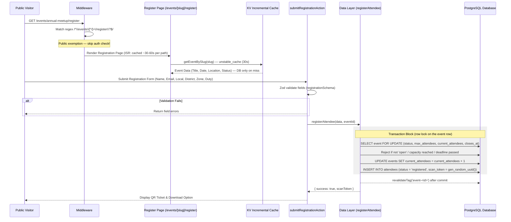
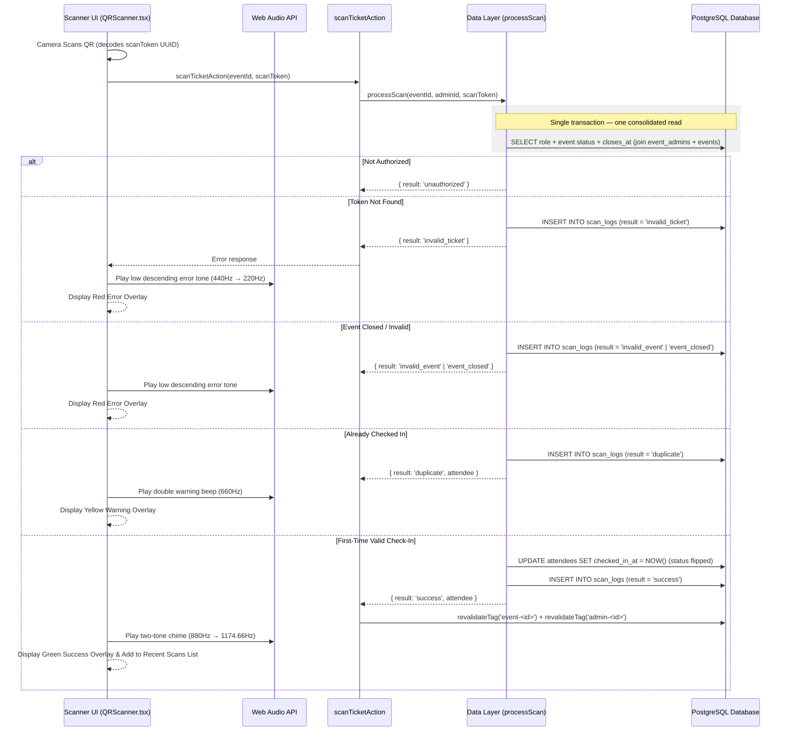

# FlowCheck — Data Flows

This document details the core data flows in FlowCheck, including public pre-registration, event management, and QR check-in verification.

---

## Flow 1: Public Pre-Registration (No Account Required)

FlowCheck permits **any user** to pre-register for an open event without needing a FlowCheck account or login credentials.

```mermaid
sequenceDiagram
    participant PublicUser as Public Visitor
    participant MW as Middleware
    participant Page as Register Page (/events/[slug]/register)
    participant Cache as KV Incremental Cache
    participant Action as submitRegistrationAction
    participant Data as Data Layer (registerAttendee)
    participant DB as PostgreSQL Database

    PublicUser->>MW: GET /events/annual-meetup/register
    MW->>MW: Match regex /^\/events\/[^/]+\/register\/?$/
    Note over MW: Public exemption — skip auth check!
    MW->>Page: Render Registration Page (ISR: cached ~30-60s per path)
    Page->>Cache: getEventBySlug(slug) — unstable_cache (30s)
    Cache-->>Page: Event Data (Title, Date, Location, Status) — DB only on miss

    PublicUser->>Action: Submit Registration Form (Name, Email, Local, District, Zone, Duty)
    Action->>Action: Zod validate fields (registrationSchema)

    alt Validation Fails
        Action-->>PublicUser: Return field errors
    end

    Action->>Data: registerAttendee(data, eventId)

    rect rgb(240, 240, 240)
        Note over Data,DB: Transaction Block (row lock on the event row)
        Data->>DB: SELECT event FOR UPDATE (status, max_attendees, current_attendees, closes_at)
        Data->>DB: Reject if not 'open' / capacity reached / deadline passed
        Data->>DB: UPDATE events SET current_attendees = current_attendees + 1
        Data->>DB: INSERT INTO attendees (status = 'registered', scan_token = gen_random_uuid())
    end

    Data-->>DB: revalidateTag('event-<id>') after commit
    Data-->>Action: { success: true, scanToken }
    Action-->>PublicUser: Display QR Ticket & Download Option
```

### Key Pre-Registration Rules:
1. **Public Access**: Excluded from Supabase session checks in `middleware.ts`.
2. **Duplicate Prevention**: enforced by the unique index `unq_event_email (event_id, email)` — a `23505` violation is mapped to "Already registered with this email".
3. **Capacity & Expiration Guard**: the transaction row-locks the event (`SELECT ... FOR UPDATE`) and rejects if `status !== 'open'`, if `current_attendees >= max_attendees`, or if `closes_at` has passed. The row lock serializes concurrent registrations so capacity can never be breached.
4. **Queue isolation**: the Google Sheets sync is enqueued **after** commit; its failure never rolls back the registration.
5. **Caching**: the page is ISR-cached (HTML) and `getEventBySlug` is data-cached (30s); a successful registration revalidates the event's caches.

---

## Flow 2: QR Scanner & Check-In Verification

During an event, authorized admins or scanners scan attendee QR code tickets via the scanner interface (`/events/[id]/scanner`).

```mermaid
sequenceDiagram
    participant ScannerPWA as Scanner UI (QRScanner.tsx)
    participant WebAudio as Web Audio API
    participant Action as scanTicketAction
    participant Data as Data Layer (processScan)
    participant DB as PostgreSQL Database

    ScannerPWA->>ScannerPWA: Camera Scans QR (decodes scanToken UUID)
    ScannerPWA->>Action: scanTicketAction(eventId, scanToken)
    Action->>Data: processScan(eventId, adminId, scanToken)

    rect rgb(240, 240, 240)
        Note over Data,DB: Single transaction — one consolidated read
        Data->>DB: SELECT role + event status + closes_at (join event_admins + events)
    end

    alt Not Authorized
        Data-->>Action: { result: 'unauthorized' }
    else Token Not Found
        Data->>DB: INSERT INTO scan_logs (result = 'invalid_ticket')
        Data-->>Action: { result: 'invalid_ticket' }
        Action-->>ScannerPWA: Error response
        ScannerPWA->>WebAudio: Play low descending error tone (440Hz → 220Hz)
        ScannerPWA-->>ScannerPWA: Display Red Error Overlay
    else Event Closed / Invalid
        Data->>DB: INSERT INTO scan_logs (result = 'invalid_event' | 'event_closed')
        Data-->>Action: { result: 'invalid_event' | 'event_closed' }
        ScannerPWA->>WebAudio: Play low descending error tone
        ScannerPWA-->>ScannerPWA: Display Red Error Overlay
    else Already Checked In
        Data->>DB: INSERT INTO scan_logs (result = 'duplicate')
        Data-->>Action: { result: 'duplicate', attendee }
        ScannerPWA->>WebAudio: Play double warning beep (660Hz)
        ScannerPWA-->>ScannerPWA: Display Yellow Warning Overlay
    else First-Time Valid Check-In
        Data->>DB: UPDATE attendees SET checked_in_at = NOW() (status flipped)
        Data->>DB: INSERT INTO scan_logs (result = 'success')
        Data-->>Action: { result: 'success', attendee }
        Action->>DB: revalidateTag('event-<id>') + revalidateTag('admin-<id>')
        ScannerPWA->>WebAudio: Play two-tone chime (880Hz → 1174.66Hz)
        ScannerPWA-->>ScannerPWA: Display Green Success Overlay & Add to Recent Scans List
    end
```

### Key Scan Rules:
1. **Consolidated read**: authorization (role), event status, and close time are fetched in a single joined query inside the transaction — minimal lock hold time.
2. **Queue isolation**: the Google Sheets sync runs **after** the transaction commits; a failing queue call never fails the scan.
3. **Cache invalidation**: successful scans revalidate the event's and scanning admin's data caches so dashboards reflect check-ins immediately.
4. **Audit trail**: every scan attempt is recorded in `scan_logs` regardless of outcome.

---

## Flow 3: Hover Prefetch (Performance)

All dashboard navigation uses `PrefetchLink` — on first hover/focus/pointer-down it:
1. Calls `router.prefetch(href, { kind: 'full' })` (route RSC payload).
2. Fires a warm-up server action (`src/actions/prefetch.ts`) that runs the target page's data queries, populating `unstable_cache` entries for that admin/event.

The subsequent navigation render then hits warm caches — see `performance.md`.
