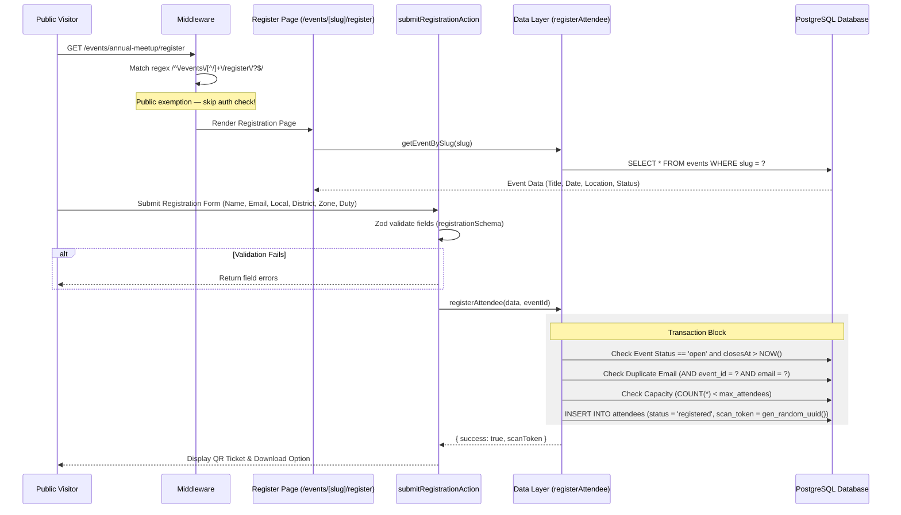
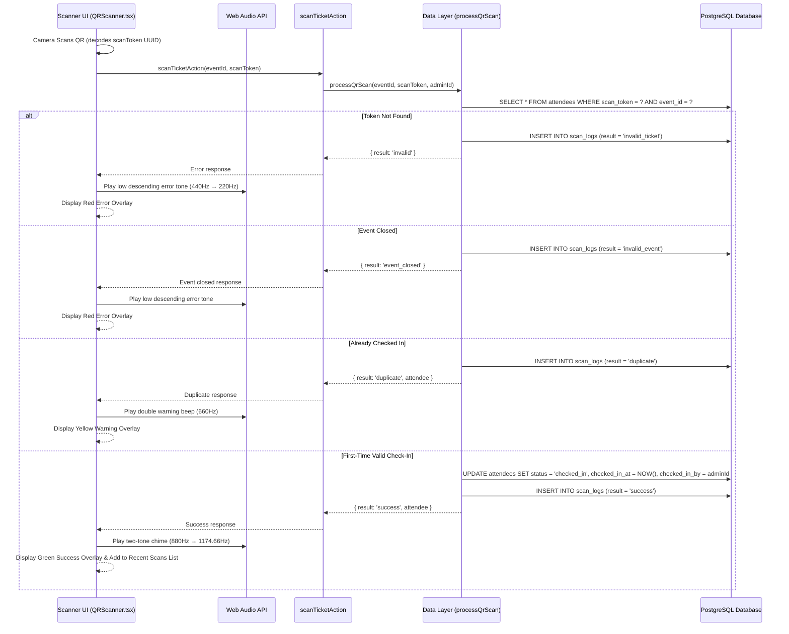

# FlowCheck — Data Flows

This document details the core data flows in FlowCheck, including public pre-registration, event management, and QR check-in verification.

---

## Flow 1: Public Pre-Registration (No Account Required)

FlowCheck permits **any user** to pre-register for an open event without needing a FlowCheck account or login credentials.

```mermaid
sequenceDiagram
    participant PublicUser as Public Visitor
    participant MW as Middleware
    participant Page as Register Page (/events/[slug]/register)
    participant Action as submitRegistrationAction
    participant Data as Data Layer (registerAttendee)
    participant DB as PostgreSQL Database

    PublicUser->>MW: GET /events/annual-meetup/register
    MW->>MW: Match regex /^\/events\/[^/]+\/register\/?$/
    Note over MW: Public exemption — skip auth check!
    MW->>Page: Render Registration Page
    Page->>Data: getEventBySlug(slug)
    Data->>DB: SELECT * FROM events WHERE slug = ?
    DB-->>Page: Event Data (Title, Date, Location, Status)

    PublicUser->>Action: Submit Registration Form (Name, Email, Local, District, Zone, Duty)
    Action->>Action: Zod validate fields (registrationSchema)

    alt Validation Fails
        Action-->>PublicUser: Return field errors
    end

    Action->>Data: registerAttendee(data, eventId)
    
    rect rgb(240, 240, 240)
        Note over Data,DB: Transaction Block
        Data->>DB: Check Event Status == 'open' and closesAt > NOW()
        Data->>DB: Check Duplicate Email (AND event_id = ? AND email = ?)
        Data->>DB: Check Capacity (COUNT(*) < max_attendees)
        Data->>DB: INSERT INTO attendees (status = 'registered', scan_token = gen_random_uuid())
    end

    Data-->>Action: { success: true, scanToken }
    Action-->>PublicUser: Display QR Ticket & Download Option
```

### Key Pre-Registration Rules:
1. **Public Access**: Excluded from Supabase session checks in `middleware.ts`.
2. **Duplicate Prevention**: Rejects duplicate registrations for the same email within the same event.
3. **Capacity & Expiration Guard**: Rejects registration if `status !== 'open'`, if current attendee count `>= maxAttendees`, or if `closesAt` timestamp has passed.

---

## Flow 2: QR Scanner & Check-In Verification

During an event, authorized admins or scanners scan attendee QR code tickets via the scanner interface (`/events/[id]/scanner`).

```mermaid
sequenceDiagram
    participant ScannerPWA as Scanner UI (QRScanner.tsx)
    participant WebAudio as Web Audio API
    participant Action as scanTicketAction
    participant Data as Data Layer (processQrScan)
    participant DB as PostgreSQL Database

    ScannerPWA->>ScannerPWA: Camera Scans QR (decodes scanToken UUID)
    ScannerPWA->>Action: scanTicketAction(eventId, scanToken)
    Action->>Data: processQrScan(eventId, scanToken, adminId)

    Data->>DB: SELECT * FROM attendees WHERE scan_token = ? AND event_id = ?

    alt Token Not Found
        Data->>DB: INSERT INTO scan_logs (result = 'invalid_ticket')
        Data-->>Action: { result: 'invalid' }
        Action-->>ScannerPWA: Error response
        ScannerPWA->>WebAudio: Play low descending error tone (440Hz → 220Hz)
        ScannerPWA-->>ScannerPWA: Display Red Error Overlay
    else Event Closed
        Data->>DB: INSERT INTO scan_logs (result = 'invalid_event')
        Data-->>Action: { result: 'event_closed' }
        Action-->>ScannerPWA: Event closed response
        ScannerPWA->>WebAudio: Play low descending error tone
        ScannerPWA-->>ScannerPWA: Display Red Error Overlay
    else Already Checked In
        Data->>DB: INSERT INTO scan_logs (result = 'duplicate')
        Data-->>Action: { result: 'duplicate', attendee }
        Action-->>ScannerPWA: Duplicate response
        ScannerPWA->>WebAudio: Play double warning beep (660Hz)
        ScannerPWA-->>ScannerPWA: Display Yellow Warning Overlay
    else First-Time Valid Check-In
        Data->>DB: UPDATE attendees SET status = 'checked_in', checked_in_at = NOW(), checked_in_by = adminId
        Data->>DB: INSERT INTO scan_logs (result = 'success')
        Data-->>Action: { result: 'success', attendee }
        Action-->>ScannerPWA: Success response
        ScannerPWA->>WebAudio: Play two-tone chime (880Hz → 1174.66Hz)
        ScannerPWA-->>ScannerPWA: Display Green Success Overlay & Add to Recent Scans List
    end
```
