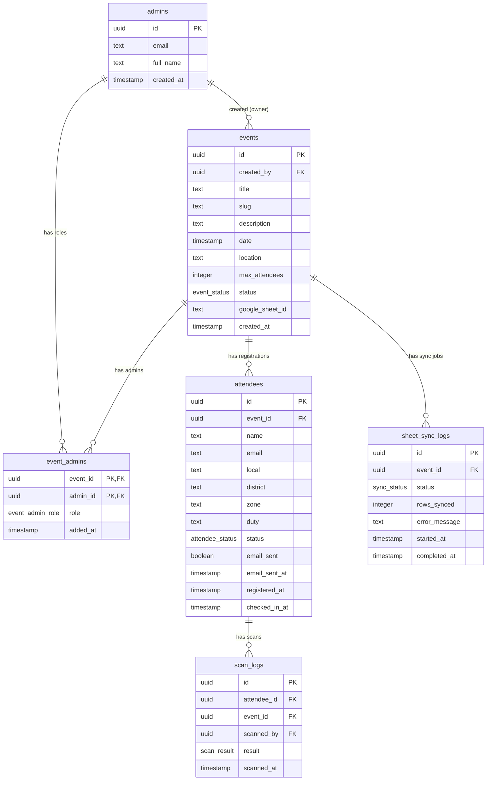

# FlowCheck — Database Schema & ORM

## 1. Schema Overview

The database uses PostgreSQL (hosted on Supabase) and is interacted with via Drizzle ORM. All dates are stored as `timestamp with time zone`.

### ER Diagram



## 2. Enums

```sql
CREATE TYPE event_status AS ENUM ('draft', 'open', 'closed', 'archived');
CREATE TYPE event_admin_role AS ENUM ('owner', 'editor', 'scanner');
CREATE TYPE attendee_status AS ENUM ('registered', 'checked_in', 'cancelled');
CREATE TYPE scan_result AS ENUM ('success', 'duplicate', 'invalid_event', 'invalid_ticket');
CREATE TYPE sync_status AS ENUM ('pending', 'processing', 'completed', 'failed');
```

## 3. Drizzle Schema

`src/lib/db/schema.ts`:

```typescript
import { pgTable, uuid, text, timestamp, integer, boolean, pgEnum, primaryKey, uniqueIndex } from 'drizzle-orm/pg-core';
import { relations } from 'drizzle-orm';

// Enums
export const eventStatusEnum = pgEnum('event_status', ['draft', 'open', 'closed', 'archived']);
export const eventAdminRoleEnum = pgEnum('event_admin_role', ['owner', 'editor', 'scanner']);
export const attendeeStatusEnum = pgEnum('attendee_status', ['registered', 'checked_in', 'cancelled']);
export const scanResultEnum = pgEnum('scan_result', ['success', 'duplicate', 'invalid_event', 'invalid_ticket']);
export const syncStatusEnum = pgEnum('sync_status', ['pending', 'processing', 'completed', 'failed']);

// Tables
export const admins = pgTable('admins', {
  id: uuid('id').primaryKey(), // Maps to auth.users.id
  email: text('email').notNull().unique(),
  fullName: text('full_name'),
  createdAt: timestamp('created_at', { withTimezone: true }).defaultNow().notNull(),
});

export const events = pgTable('events', {
  id: uuid('id').defaultRandom().primaryKey(),
  createdBy: uuid('created_by').notNull().references(() => admins.id),
  title: text('title').notNull(),
  slug: text('slug').notNull().unique(),
  description: text('description'),
  date: timestamp('date', { withTimezone: true }).notNull(),
  location: text('location'),
  maxAttendees: integer('max_attendees'),
  status: eventStatusEnum('status').default('draft').notNull(),
  googleSheetId: text('google_sheet_id'),
  createdAt: timestamp('created_at', { withTimezone: true }).defaultNow().notNull(),
});

export const eventAdmins = pgTable('event_admins', {
  eventId: uuid('event_id').notNull().references(() => events.id, { onDelete: 'cascade' }),
  adminId: uuid('admin_id').notNull().references(() => admins.id, { onDelete: 'cascade' }),
  role: eventAdminRoleEnum('role').default('scanner').notNull(),
  addedAt: timestamp('added_at', { withTimezone: true }).defaultNow().notNull(),
}, (t) => ({
  pk: primaryKey({ columns: [t.eventId, t.adminId] }),
}));

export const attendees = pgTable('attendees', {
  id: uuid('id').defaultRandom().primaryKey(),
  eventId: uuid('event_id').notNull().references(() => events.id, { onDelete: 'cascade' }),
  name: text('name').notNull(),
  email: text('email').notNull(),
  local: text('local'),      // e.g., Mabolo, Mandaue
  district: text('district'), // e.g., North, South
  zone: text('zone'),         // e.g., 1, 2, 3
  duty: text('duty'),         // e.g., Volunteer, Staff
  status: attendeeStatusEnum('status').default('registered').notNull(),
  emailSent: boolean('email_sent').default(false).notNull(),
  emailSentAt: timestamp('email_sent_at', { withTimezone: true }),
  registeredAt: timestamp('registered_at', { withTimezone: true }).defaultNow().notNull(),
  checkedInAt: timestamp('checked_in_at', { withTimezone: true }),
}, (t) => ({
  unqEventEmail: uniqueIndex('unq_event_email').on(t.eventId, t.email),
}));

export const scanLogs = pgTable('scan_logs', {
  id: uuid('id').defaultRandom().primaryKey(),
  attendeeId: uuid('attendee_id').references(() => attendees.id, { onDelete: 'set null' }),
  eventId: uuid('event_id').notNull().references(() => events.id, { onDelete: 'cascade' }),
  scannedBy: uuid('scanned_by').notNull().references(() => admins.id),
  result: scanResultEnum('result').notNull(),
  scannedAt: timestamp('scanned_at', { withTimezone: true }).defaultNow().notNull(),
});

export const sheetSyncLogs = pgTable('sheet_sync_logs', {
  id: uuid('id').defaultRandom().primaryKey(),
  eventId: uuid('event_id').notNull().references(() => events.id, { onDelete: 'cascade' }),
  status: syncStatusEnum('status').default('pending').notNull(),
  rowsSynced: integer('rows_synced').default(0).notNull(),
  errorMessage: text('error_message'),
  startedAt: timestamp('started_at', { withTimezone: true }),
  completedAt: timestamp('completed_at', { withTimezone: true }),
});
```

## 4. Google Sheets Mapping

When records sync to Google Sheets, they map as follows:

| Column | Data Source | Example |
|---|---|---|
| A | row index | `1` |
| B | `attendees.name` | `John Doe` |
| C | `attendees.email` | `john@example.com` |
| D | `attendees.local` | `Mabolo` |
| E | `attendees.district` | `North` |
| F | `attendees.zone` | `1` |
| G | `attendees.duty` | `Volunteer` |
| H | `attendees.status` | `checked_in` |
| I | `attendees.checked_in_at` | `2026-07-12 14:00:00 UTC` |

## 5. Email Daily Cap Tracking

We do not use a separate table to track email quotas. Instead, the 290/day limit is enforced by querying the `attendees` table directly before inserting a new record.

**Query:**
```sql
SELECT COUNT(*) 
FROM attendees 
WHERE email_sent = true 
  AND DATE(email_sent_at) = CURRENT_DATE;
```
If the count >= 290, the server accepts the registration but queues the email (`email_sent = false`) to be processed by a Cron Trigger.

## 6. Indexes

- `events.slug` (UNIQUE): Fast lookup for public registration pages.
- `attendees(event_id, email)` (UNIQUE): Prevents duplicate registrations.
- `attendees(event_id)`: Speeds up counting current registrants for capacity checks.
- `attendees.registered_at`: Speeds up the daily email cap query.
- `scan_logs(event_id)`: Speeds up scanning analytics.

## 7. Row Level Security (RLS) Policies

All tables must have RLS enabled: `ALTER TABLE table_name ENABLE ROW LEVEL SECURITY;`

Since we are using Drizzle ORM in `server-only` actions, we use the Supabase Service Role key (which bypasses RLS) for internal operations. However, enabling RLS is a required defense-in-depth measure to prevent accidental data leaks if a client-side Supabase client is ever used.

- All tables: `CREATE POLICY "Deny all" ON table_name FOR ALL USING (false);`

## 8. Migration Strategy

We use `drizzle-kit` for schema migrations.
1. Make changes to `schema.ts`.
2. Run `npx drizzle-kit generate` to create SQL migration files.
3. Run `npx drizzle-kit push` (development) or `npx drizzle-kit migrate` (production CI/CD).
4. Do **not** use the Supabase Dashboard UI to alter tables, as this will drift from the Drizzle source of truth.
