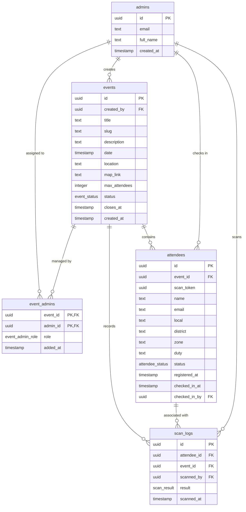

# FlowCheck — Database Schema

FlowCheck uses PostgreSQL hosted on Supabase and managed via Drizzle ORM (`src/lib/db/schema.ts`).

---

## Entity Relationship Diagram


```mermaid
erDiagram
    admins ||--o{ events : "creates"
    admins ||--o{ event_admins : "assigned to"
    events ||--o{ event_admins : "managed by"
    events ||--o{ attendees : "contains"
    events ||--o{ scan_logs : "records"
    attendees ||--o{ scan_logs : "associated with"
    admins ||--o{ attendees : "checks in"
    admins ||--o{ scan_logs : "scans"

    admins {
        uuid id PK
        text email
        text full_name
        timestamp created_at
    }

    events {
        uuid id PK
        uuid created_by FK
        text title
        text slug
        text description
        timestamp date
        text location
        text map_link
        integer max_attendees
        event_status status
        timestamp closes_at
        timestamp created_at
    }

    event_admins {
        uuid event_id PK, FK
        uuid admin_id PK, FK
        event_admin_role role
        timestamp added_at
    }

    attendees {
        uuid id PK
        uuid event_id FK
        uuid scan_token
        text name
        text email
        text local
        text district
        text zone
        text duty
        attendee_status status
        timestamp registered_at
        timestamp checked_in_at
        uuid checked_in_by FK
    }

    scan_logs {
        uuid id PK
        uuid attendee_id FK
        uuid event_id FK
        uuid scanned_by FK
        scan_result result
        timestamp scanned_at
    }
```

---

## Enums

```sql
CREATE TYPE event_status AS ENUM ('draft', 'open', 'closed', 'archived');
CREATE TYPE event_admin_role AS ENUM ('owner', 'editor', 'scanner');
CREATE TYPE attendee_status AS ENUM ('registered', 'checked_in', 'cancelled');
CREATE TYPE scan_result AS ENUM ('success', 'duplicate', 'invalid_event', 'invalid_ticket');
```

---

## Table Definitions

### 1. `admins`
Maps directly to `auth.users.id` from Supabase Auth.
- `id`: `uuid` (Primary Key)
- `email`: `text` (Unique, Not Null)
- `fullName`: `text`
- `createdAt`: `timestamp with time zone` (Default: `now()`)

### 2. `events`
- `id`: `uuid` (Primary Key, Default: `gen_random_uuid()`)
- `createdBy`: `uuid` (Foreign Key → `admins.id`)
- `title`: `text` (Not Null)
- `slug`: `text` (Unique, Not Null)
- `description`: `text`
- `date`: `timestamp with time zone` (Not Null)
- `location`: `text`
- `mapLink`: `text`
- `maxAttendees`: `integer`
- `status`: `event_status` (Default: `'draft'`)
- `closesAt`: `timestamp with time zone`
- `createdAt`: `timestamp with time zone` (Default: `now()`)

### 3. `event_admins`
Join table connecting admins to events with assigned permissions.
- `eventId`: `uuid` (Foreign Key → `events.id`, On Delete Cascade)
- `adminId`: `uuid` (Foreign Key → `admins.id`, On Delete Cascade)
- `role`: `event_admin_role` (Default: `'scanner'`) — `'owner'`, `'editor'`, `'scanner'`
- `addedAt`: `timestamp with time zone` (Default: `now()`)
- **Primary Key**: `(eventId, adminId)`

### 4. `attendees`
Contains pre-registration and check-in records for attendees.
- `id`: `uuid` (Primary Key, Default: `gen_random_uuid()`)
- `eventId`: `uuid` (Foreign Key → `events.id`, On Delete Cascade)
- `scanToken`: `uuid` (Unique, Default: `gen_random_uuid()`)
- `name`: `text` (Not Null)
- `email`: `text` (Not Null)
- `local`: `text`
- `district`: `text`
- `zone`: `text`
- `duty`: `text`
- `status`: `attendee_status` (Default: `'registered'`) — `'registered'`, `'checked_in'`, `'cancelled'`
- `registeredAt`: `timestamp with time zone` (Default: `now()`)
- `checkedInAt`: `timestamp with time zone`
- `checkedInBy`: `uuid` (Foreign Key → `admins.id`, On Delete Set Null)
- **Unique Index**: `(eventId, email)`

### 5. `scan_logs`
Audit log of every QR code scan attempt.
- `id`: `uuid` (Primary Key, Default: `gen_random_uuid()`)
- `attendeeId`: `uuid` (Foreign Key → `attendees.id`, On Delete Set Null)
- `eventId`: `uuid` (Foreign Key → `events.id`, On Delete Cascade)
- `scannedBy`: `uuid` (Foreign Key → `admins.id`)
- `result`: `scan_result` — `'success'`, `'duplicate'`, `'invalid_event'`, `'invalid_ticket'`
- `scannedAt`: `timestamp with time zone` (Default: `now()`)
