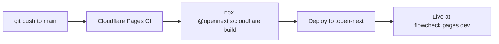

# Deployment Guide

This guide walks through setting up FlowCheck from scratch — every service, every key, every config file. FlowCheck runs entirely on free tiers with **zero monthly cost**.

> [!NOTE]
> FlowCheck is hosted on **Cloudflare Pages** (not Vercel). There is no `vercel.json`, no Redis, and no paid infrastructure required.

---

## Prerequisites

| Tool | Version | Install |
|------|---------|---------|
| Node.js | 20+ | [nodejs.org](https://nodejs.org) |
| npm or pnpm | Latest | Bundled with Node.js / `npm i -g pnpm` |
| Git | Latest | [git-scm.com](https://git-scm.com) |
| Wrangler CLI | Latest | `npm install -g wrangler` |
| Docker | Latest | [docker.com](https://docker.com) (local dev only) |

You will also need accounts on:

- [GitHub](https://github.com) — source control + CI/CD trigger
- [Cloudflare](https://dash.cloudflare.com) — hosting, queues, cron
- [Supabase](https://supabase.com) — database + auth
- [Brevo](https://brevo.com) — transactional email
- [Google Cloud](https://console.cloud.google.com) — Sheets API + OAuth

---

## Service Setup

### 1. Supabase (Database + Auth)

Supabase provides PostgreSQL, connection pooling via Supavisor, and Google OAuth — all on the free tier.

**Create the project:**

1. Go to [supabase.com](https://supabase.com) and create a free account
2. Click **New Project**, choose a name and region close to your users
3. Set a strong database password — save it securely
4. Wait for the project to provision (~2 minutes)

**Collect your credentials:**

| Credential | Where to find it |
|------------|-----------------|
| `NEXT_PUBLIC_SUPABASE_URL` | Settings → API → Project URL |
| `NEXT_PUBLIC_SUPABASE_ANON_KEY` | Settings → API → `anon` `public` key |
| `SUPABASE_SERVICE_ROLE_KEY` | Settings → API → `service_role` key (keep secret!) |
| `DATABASE_URL` | Settings → Database → Connection string → URI (Supavisor / port `6543`) |
| `DIRECT_DATABASE_URL` | Settings → Database → Connection string → URI (Direct / port `5432`) |

> [!IMPORTANT]
> Use the **Supavisor pooled connection** (port `6543`) for the application runtime (`DATABASE_URL`). Use the **direct connection** (port `5432`) only for migrations (`DIRECT_DATABASE_URL`). Mixing these up will cause connection exhaustion.

**Enable Google OAuth:**

1. Go to Authentication → Providers → Google
2. Toggle **Enable**
3. Enter the OAuth Client ID and Client Secret from Google Cloud (see step 3 below)
4. Copy the **Callback URL** — you'll paste it into Google Cloud

**Free tier limits:**

- 500 MB database storage
- 50,000 monthly active users
- 2 projects
- 1 GB file storage
- 2 million Edge Function invocations

---

### 2. Brevo (Transactional Email)

Brevo (formerly Sendinblue) sends registration confirmation emails with QR codes. The free tier allows **300 emails/day** — we cap at **290** as a safety margin.

**Create the account:**

1. Go to [brevo.com](https://www.brevo.com) and sign up
2. Complete account verification

**Generate an API key:**

1. Navigate to **SMTP & API** → **API Keys**
2. Click **Generate a new API key**
3. Name it `FlowCheck Production`
4. Copy the key immediately — it won't be shown again

**Verify your sending domain:**

1. Go to **Senders, Domains & Dedicated IPs** → **Domains**
2. Add your domain (e.g., `yourdomain.com`)
3. Add the DNS records Brevo provides (DKIM, SPF, DMARC)
4. Click **Verify** once DNS has propagated

> [!TIP]
> You don't need any npm package for Brevo. The API is a single `fetch()` call:
> ```
> POST https://api.brevo.com/v3/smtp/email
> Headers: { "api-key": BREVO_API_KEY, "Content-Type": "application/json" }
> ```

**Free tier limits:**

- 300 emails per day (hard daily reset at midnight UTC)
- Unlimited contacts
- No credit card required

---

### 3. Google Cloud (Service Account + OAuth)

Google Cloud provides two things: a **Service Account** for server-side Sheets/Drive API access, and **OAuth 2.0 credentials** for user login via Supabase Auth.

**Create the GCP project:**

1. Go to [console.cloud.google.com](https://console.cloud.google.com)
2. Click **New Project** → name it `FlowCheck`
3. Select the project from the dropdown

**Enable APIs:**

1. Go to **APIs & Services** → **Library**
2. Search and enable:
   - **Google Sheets API**
   - **Google Drive API**

**Create a Service Account (for Sheets sync):**

1. Go to **APIs & Services** → **Credentials**
2. Click **Create Credentials** → **Service Account**
3. Name: `flowcheck-sheets`
4. Skip optional permissions
5. Click into the created service account → **Keys** tab
6. **Add Key** → **Create new key** → **JSON**
7. Download the JSON file — extract these two values:
   - `client_email` → `GOOGLE_SERVICE_ACCOUNT_EMAIL`
   - `private_key` → `GOOGLE_SERVICE_ACCOUNT_PRIVATE_KEY`

> [!CAUTION]
> The `private_key` contains newline characters (`\n`). When setting it as an environment variable, wrap the entire value in double quotes and preserve the `\n` sequences. Do not strip them.

**Create OAuth 2.0 credentials (for Google login):**

1. Still in **Credentials**, click **Create Credentials** → **OAuth client ID**
2. Application type: **Web application**
3. Name: `FlowCheck Login`
4. Authorized redirect URIs: paste the **Callback URL** from Supabase Auth
5. Copy the **Client ID** and **Client Secret** → enter them in Supabase Auth → Google provider settings

---

### 4. Cloudflare (Hosting + Queues + Workers + Cron)

Cloudflare hosts the Next.js app via Pages, processes background jobs via Queues, and runs scheduled tasks via Cron Triggers.

**Create your account:**

1. Go to [dash.cloudflare.com](https://dash.cloudflare.com) and sign up
2. Install and authenticate the CLI:
   ```bash
   npm install -g wrangler
   wrangler login
   ```

**Connect to Cloudflare Pages:**

1. In the Cloudflare dashboard, go to **Workers & Pages** → **Create**
2. Select **Pages** → **Connect to Git**
3. Authorize GitHub and select the `FlowCheck` repository
4. Configure build settings:

   | Setting | Value |
   |---------|-------|
   | Build command | `npx @opennextjs/cloudflare build` |
   | Build output directory | `.open-next` |
   | Root directory | `/` |
   | Node.js version | `20` |

5. Click **Save and Deploy**

**Set environment variables:**

1. Go to the Pages project → **Settings** → **Environment Variables**
2. Add all variables from the [Environment Variables](#environment-variables) section below
3. Set them for **both** Production and Preview environments

**Create the Queue:**

```bash
wrangler queues create sheets-sync
```

**Deploy the Queue Consumer Worker:**

```bash
wrangler deploy workers/sheets-sync.ts
```

**Free tier limits:**

| Resource | Free Limit |
|----------|-----------|
| Pages requests | 100,000 / day |
| Pages bandwidth | Unlimited |
| Worker requests | 100,000 / day |
| Worker CPU time | 10 ms / invocation |
| Queue operations | 1,000,000 / month |
| Cron Triggers | 5 per worker |

---

## Configuration Files

### `wrangler.toml`

This file lives at the project root and configures Cloudflare Workers, Queues, and Cron Triggers.

```toml
name = "flowcheck"
compatibility_date = "2025-01-01"

[[queues.producers]]
queue = "sheets-sync"
binding = "SHEETS_QUEUE"

[[queues.consumers]]
queue = "sheets-sync"
max_batch_size = 50
max_batch_timeout = 30

[triggers]
crons = ["*/2 * * * *"]
```

> [!NOTE]
> `max_batch_size = 50` means the consumer receives up to 50 messages at once. `max_batch_timeout = 30` means it waits up to 30 seconds to fill the batch before processing. This reduces API calls to Google Sheets.

### `open-next.config.ts`

This file configures the OpenNext adapter for Cloudflare Pages. It lives at the project root.

```typescript
import type { OpenNextConfig } from '@opennextjs/cloudflare';

const config: OpenNextConfig = {};

export default config;
```

---

## Environment Variables

Create `.env.example` at the project root (and copy to `.env.local` for local development):

```bash
# ──────────────────────────────────────────
# Supabase
# ──────────────────────────────────────────
DATABASE_URL=                          # Supavisor pooled connection (port 6543)
DIRECT_DATABASE_URL=                   # Direct connection (port 5432, migrations only)
NEXT_PUBLIC_SUPABASE_URL=
NEXT_PUBLIC_SUPABASE_ANON_KEY=
SUPABASE_SERVICE_ROLE_KEY=

# ──────────────────────────────────────────
# Brevo (Email)
# ──────────────────────────────────────────
BREVO_API_KEY=
EMAIL_FROM_NAME=FlowCheck
EMAIL_FROM_EMAIL=noreply@yourdomain.com

# ──────────────────────────────────────────
# Google Service Account
# ──────────────────────────────────────────
GOOGLE_SERVICE_ACCOUNT_EMAIL=
GOOGLE_SERVICE_ACCOUNT_PRIVATE_KEY=

# ──────────────────────────────────────────
# App
# ──────────────────────────────────────────
NEXT_PUBLIC_APP_URL=https://flowcheck.pages.dev
CRON_SECRET=                           # Protects cron API routes from public access

# ──────────────────────────────────────────
# Email Safety
# ──────────────────────────────────────────
DAILY_EMAIL_LIMIT=290                  # Safety cap (Brevo free tier = 300/day)
```

> [!WARNING]
> Never commit `.env.local` to Git. The `.gitignore` file should already exclude it. Double-check before pushing.

---

## Local Development

### 1. Clone and install

```bash
git clone https://github.com/yourusername/FlowCheck.git
cd FlowCheck
npm install
```

### 2. Start the database

```bash
docker-compose up -d
```

> [!TIP]
> The `docker-compose.yml` only runs PostgreSQL — no Redis or any other service is needed. FlowCheck has zero caching dependencies.

### 3. Configure environment

```bash
cp .env.example .env.local
```

Fill in all values. For local development, you can use your Supabase project's direct connection string or point to the local Docker Postgres.

### 4. Run migrations

```bash
npx drizzle-kit push
```

### 5. Start the dev server

```bash
npm run dev
```

The app will be available at [http://localhost:3000](http://localhost:3000).

### 6. Test Cloudflare Workers locally

To test the queue consumer worker in isolation:

```bash
wrangler dev workers/sheets-sync.ts
```

> [!NOTE]
> Queue bindings are not fully available in local dev mode. For end-to-end queue testing, deploy to a Cloudflare preview environment.

---

## Production Deployment

Deployments are automatic via GitHub integration:



1. Push to `main` → triggers Cloudflare Pages build
2. OpenNext adapter builds the Next.js app for Cloudflare's edge runtime
3. Static assets are served from Cloudflare's CDN
4. Server-side routes run as Cloudflare Workers

### Custom Domain

1. In Cloudflare Pages → **Custom domains** → **Set up a custom domain**
2. Enter your domain (e.g., `flowcheck.yourdomain.com`)
3. Cloudflare automatically provisions an SSL certificate

---

## Scaling Up

FlowCheck is designed to run on free tiers. When you outgrow them, here's what to upgrade and what it costs:

| Service | Free Limit | Paid Plan | Cost | What You Get |
|---------|-----------|-----------|------|-------------|
| Cloudflare Workers | 100K req/day | Workers Paid | $5/mo | 10M req/mo, 30ms CPU time |
| Supabase | 500MB DB, 50K MAU | Pro | $25/mo | 8GB DB, 100K MAU, daily backups |
| Brevo | 300 emails/day | Starter | $9/mo | 5,000 emails/mo, no daily limit |
| Google Sheets API | 60 req/min | Quota increase | Free | Request via GCP Console |

> [!TIP]
> Most events with under 500 attendees will never hit any of these limits. A church running weekly services with 200 attendees uses roughly:
> - ~200 emails/day (well under 300)
> - ~200 queue operations/week (well under 1M/month)
> - ~400 requests/day (well under 100K)

### When to upgrade

- **Supabase**: When your database exceeds 500MB or you have > 50K monthly users
- **Brevo**: When a single day's registrations exceed 290 (multiple concurrent events)
- **Cloudflare**: When you exceed 100K requests/day consistently (very unlikely for attendance)
- **Google Sheets**: When sync frequency needs to exceed 60 writes/minute (batch sync avoids this)
