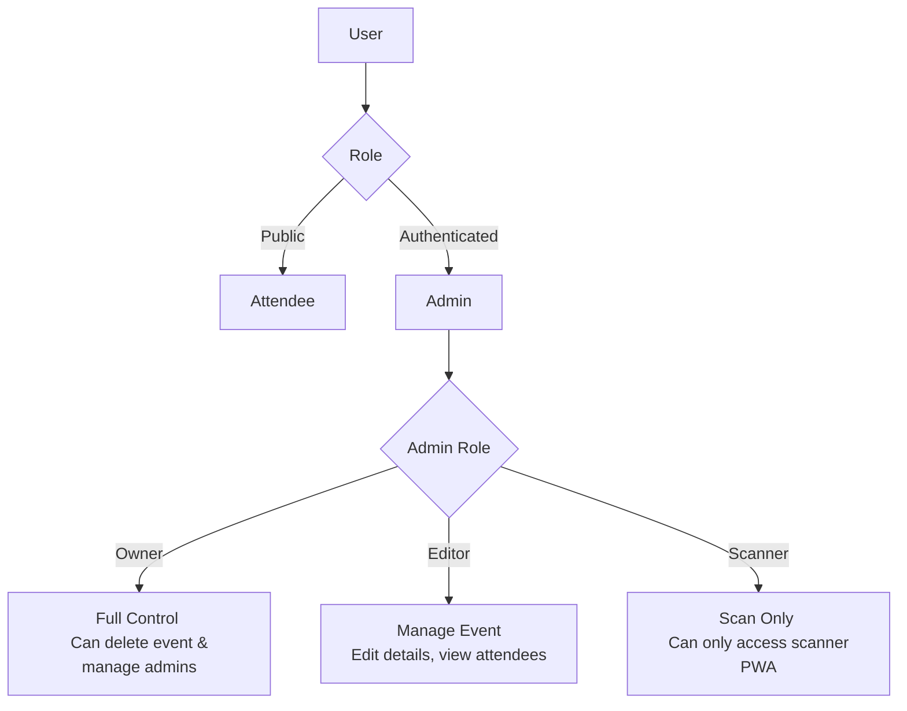
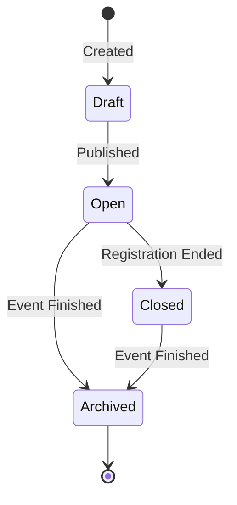

# FlowCheck — Features & Requirements

A zero-configuration, web-based event attendance system designed for non-technical administrative staff.

## 1. User Roles

## 2. Feature Priority Matrix

| Feature | Priority | Target Release |
|---|---|---|
| Event Management (CRUD) | P0 | v1 (MVP) |
| Attendee Registration | P0 | v1 (MVP) |
| QR Code Generation & Delivery | P0 | v1 (MVP) |
| QR Scanner PWA (Web) | P0 | v1 (MVP) |
| Google Sheets Integration | P0 | v1 (MVP) |
| Admin Authentication (Google OAuth) | P0 | v1 (MVP) |
| Security (Rate Limiting, Cap) | P0 | v1 (MVP) |
| Offline Scanning | P2 | Future |
| Real-time Dashboard | P2 | Future |
| Custom Registration Fields | P2 | Future |
| Bulk QR Download / CSV Export | P2 | Future |

## 3. Core Features (v1 MVP)

### 3.1 Event Management (P0)

Admins can create and manage events. Each event acts as a container for registrations and scans.

**Specifications:**
- Create, edit, and delete events.
- Event fields: Title, Description, Date, Location, Max Attendees.
- Public registration link generated via URL slug (e.g., `/events/tech-summit-2026/register`).
- Google Sheet auto-provisioned when the event is published.
- Multi-admin support: Owners can invite others as owners, editors, or scanners.

**Event Lifecycle:**

**User Stories:**
- [x] As an admin, I want to create an event so attendees can register.
- [x] As an admin, I want to invite my team as scanners so they can help at the door without having full edit access.
- [x] As an admin, I want a Google Sheet automatically created so I can view the data without managing the database.

### 3.2 Attendee Registration (P0)

Public-facing form for attendees to sign up for an event.

**Specifications:**
- Public web form (no login required).
- Fields: Name, Email, Local (e.g., Mabolo, Mandaue), District (South/North), Zone (1-5), Duty (Tungkulin).
- Registration only allowed when event status is `open`.
- Enforces capacity (`max_attendees`).
- Duplicate detection: Prevents same email from registering twice for the same event.
- **Daily Email Cap Guard:** If the global 290 emails/day cap is reached, the registration is **still saved**, but the email is queued. The success message will say: "Due to high volume, your QR code ticket will be emailed to you within 24-48 hours."
- Cloudflare Cron Trigger processes queued emails daily as quota becomes available.

**User Stories:**
- [x] As an attendee, I want to fill out a simple form to register.
- [x] As an attendee, I want to know immediately if the event is full or if I've already registered.

### 3.3 QR Code Generation & Delivery (P0)

Generates and sends the unique entry ticket.

**Specifications:**
- Generates a UUID v4 token per attendee.
- QR code contains *only* the UUID (no PII).
- Clean, standard design (no logos/branding) using pure JS `qrcode`.
- Delivered synchronously via email using Brevo REST API with an inline image.
- QR token expires when the event status becomes `closed` or `archived`.
- Email includes a text-based fallback token.

**User Stories:**
- [x] As an attendee, I want to receive my QR code via email immediately after registering.
- [x] As a security-conscious user, I appreciate that the QR code doesn't contain my personal information in plain text.

### 3.4 QR Scanner PWA (P0)

The tool admins use at the door to check people in.

**Specifications:**
- Web-based scanner (no app store installation).
- Works on both phone rear cameras and laptop webcams.
- Installable as a PWA ("Add to Home Screen").
- Requires HTTPS.
- Online-only for v1 (must have internet connection).
- Feedback mechanisms:
  - **Success:** Green flash, success sound, displays attendee name & location.
  - **Duplicate:** Yellow flash, warning sound, displays original check-in time.
  - **Invalid/Expired:** Red flash, error sound.
- Auto-resumes scanning after 2-3 seconds.
- **Manual Check-in Fallback:** If an attendee hasn't received their queued email yet, admins can manually verify and check them in using the synced Google Sheet.

**User Stories:**
- [x] As a door scanner, I want to use my own phone without downloading an app.
- [x] As a door scanner, I want clear visual and audio feedback so I don't have to constantly look at the screen.

### 3.5 Google Sheets Integration (P0)

The final ledger for administrative staff.

**Specifications:**
- Auto-provisioned per event via a Google Service Account.
- Shared with all event admins (editor access).
- Columns: `# | Name | Email | Local | District | Zone | Duty | Status | Checked In At`
- Synced automatically via Cloudflare Queues (batching scans).
- Catch-up sync every 2 minutes via Cloudflare Cron Triggers.
- Full refresh strategy (idempotent writes).

**User Stories:**
- [x] As an event organizer, I want to see a live-updating spreadsheet of who is attending.

### 3.6 Security Features (P0)
- See `security.md` for full details. Includes one-time-use tokens, rate limiting, and daily email caps.

### 3.7 Admin Authentication (P0)
- Google OAuth via Supabase Auth. No password management required.

## 4. Non-Functional Requirements
- **Performance:** QR Scan response < 500ms. Registration (including email) < 5s.
- **Accessibility:** WCAG 2.1 AA compliant UI.
- **Mobile-First:** Scanner and registration form must be perfectly usable on mobile devices.

## 5. Future Roadmap (P2)
- Offline scanning mode with IndexedDB sync queue.
- Real-time internal dashboard (charts, scan rate).
- Custom registration fields.
- Bulk QR code download (PDF).
- CSV exports.
- SMS delivery options.
