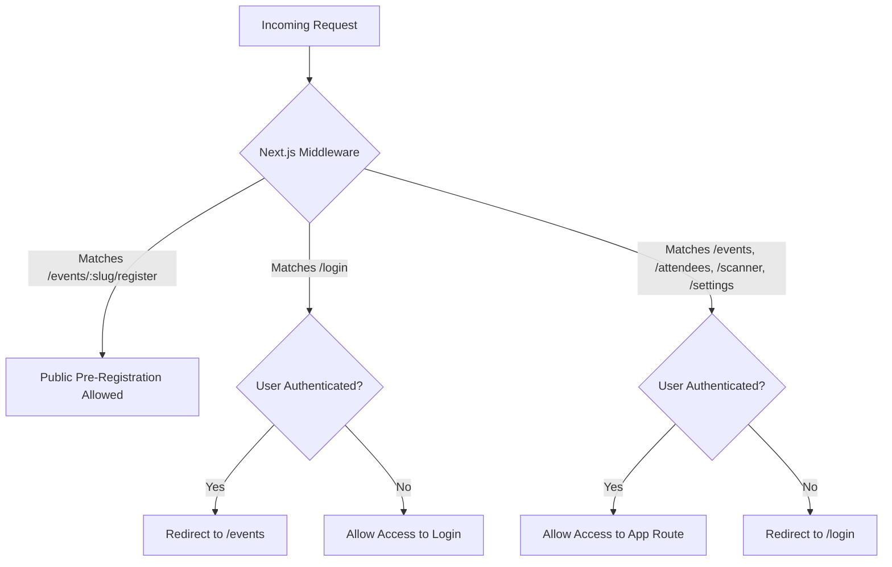

# FlowCheck — Security Model & Route Access Controls

FlowCheck implements defense-in-depth security across middleware, server actions, database schema, cache scoping, and route controls.

---

## 1. Route Access Model

### Route Policy Table

| Route Pattern | Access Level | Description |
|---|---|---|
| `/events/[slug]/register` | **Public (Unauthenticated)** | Any visitor can pre-register for open events. ISR-cached, public content only. |
| `/login` | **Public (Unauthenticated)** | Admin login page. Authenticated admins are redirected to `/events`. |
| `/events` | **Authenticated (Admin)** | Dashboard overview (stats + recent events). |
| `/events/all` | **Authenticated (Admin)** | Paginated, virtualized event archive with search. |
| `/events/new` | **Authenticated (Admin)** | Event creation form. |
| `/events/[id]/settings` | **Authenticated (team member)** | Event settings; ownership enforced in DAL via `event_admins` join. |
| `/events/[id]/edit` | **Authenticated (owner/editor)** | Edit form; `scanner` role is redirected away. |
| `/events/[id]/scanner` | **Authenticated (team member)** | Door check-in scanner PWA. |
| `/attendees` | **Authenticated (Admin)** | Attendee registry (scoped to the admin's allowed events). |
| `/scanner` | **Authenticated (Admin)** | Scanner event selection. |
| `/settings` | **Authenticated (Admin)** | Account settings. |
| `/api/*` | **Varies** | Only the public registration POST (`/api/events/:id/register`) is open; diagnostics are masked, cron requires `CRON_SECRET`. |

---

## 2. Server Action & Data Layer Validation

- **Zod Schema Parsing**: Every server action (`submitRegistrationAction`, `createEvent`, `updateEvent`, registration endpoint) parses inputs through explicit Zod schemas before interacting with data services.
- **Parametrized SQL Queries**: Database interactions are managed via Drizzle ORM, which automatically parameterizes inputs. Full-text search terms (`to_tsquery`/`websearch_to_tsquery`) are always bound parameters; event search additionally strips non-alphanumeric characters.
- **Transactional Consistency**: Registrations and scans execute inside Drizzle transactions with row locking (`FOR UPDATE`) to prevent race conditions on capacity checks and duplicate email verification.
- **Ownership Enforcement**: `updateEvent` (both full and empty-payload paths), `deleteEvent`, and `publishEventAction` verify the caller is a team member (and `owner`/`editor` where required) via `EXISTS`/join on `event_admins`. `getEventById` throws `Unauthorized` for non-team-members.
- **Team Role Integrity**: `addEventAdmin` refuses role changes on `owner` rows unless the caller is an owner, and never demotes the sole owner of an event (prevents an editor from seizing an event).
- **Tenant-Scoped Caching**: every `unstable_cache` key embeds `adminId` and/or `eventId` — no cache entry is servable across tenant boundaries. `revalidateTag` uses the same scoped tags (`admin-…`, `event-…`, `slug-…`).

---

## 3. Data Privacy & Token Integrity

- **Opaque Scan Tokens**: QR codes store a cryptographically random UUID v4 token (`scan_token`), not personal information (PII). Lookup by email returns the token only for the (event, email) pair — an intended "Forgot QR" feature; treat the token as a bearer credential.
- **One-Time Check-In Enforcement**: Scan tokens change attendee status from `registered` to `checked_in`; scanning twice logs a `duplicate` result with a warning overlay.
- **Audit Logging**: Scan attempts (successful, duplicate, invalid, closed) are logged to `scan_logs` with timestamps and administrator account IDs.
- **Public API surface**: the only unauthenticated API endpoints are the public registration POST and masked diagnostics. The former `GET /api/events` endpoints (which returned full event rows, including drafts and Google sheet IDs) were removed; diagnostics return generic status only — raw DB errors/stacks are logged server-side.

---

## 4. HTTP Security Headers

Applied in `next.config.ts` (`headers()` for all paths) and reinforced in the middleware:

`Strict-Transport-Security`, `X-Frame-Options: DENY`, `X-Content-Type-Options: nosniff`, `Referrer-Policy: strict-origin-when-cross-origin`, `Permissions-Policy`, `Cross-Origin-Opener-Policy`, `Cross-Origin-Resource-Policy`, and a strict `Content-Security-Policy`. `poweredByHeader` is disabled.

---

## 5. Rate Limiting & Volumetric Protection (Cloudflare WAF)

Public pre-registration routes (`/events/*/register`) and the registration API should be protected at the edge by a Cloudflare WAF rate-limiting rule:

- **Target Route**: `POST /events/*/register`
- **Suggested Threshold**: 5 requests per 1 minute per IP address (`ip.src`)
- **Action**: `Block` (HTTP 429)

> Note: this rule is a **deployment configuration** on the Cloudflare account, not implemented in application code. Verify it is configured before large public events.

---

## 6. Known Security History (resolved)

| Issue | Fix |
|---|---|
| IDOR in `updateEvent` empty-payload path (any admin could read any event's full row) | Ownership join added before the early return (`src/data/events.ts`) |
| Editor could demote/eject an event owner via the team upsert | Owner-role protection + sole-owner guard in `addEventAdmin` |
| Unauthenticated `GET /api/events` leaked all events (drafts, sheet IDs, creator UUIDs) | Endpoints removed; only the registration POST remains |
| `/api/test-db` and `/api/health` returned raw DB errors/stacks | Errors masked in responses, logged server-side |
| Hardcoded fallback HMAC secret (`default_scanner_secret_key`) | Dead module removed |
