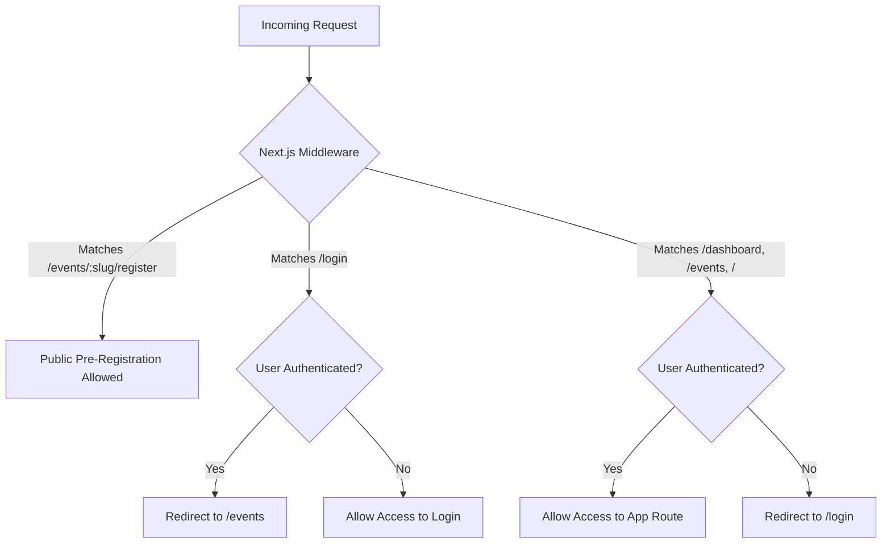

# FlowCheck — Security Model & Route Access Controls

FlowCheck implements defense-in-depth security across middleware, server actions, database schema, and route controls.

---

## 1. Route Access Model

### Route Policy Table

| Route Pattern | Access Level | Description |
|---|---|---|
| `/events/[slug]/register` | **Public (Unauthenticated)** | Allows any visitor to pre-register for open events without an account. |
| `/login` | **Public (Unauthenticated)** | Admin login page. Authenticated admins are redirected to `/events`. |
| `/events` | **Authenticated (Admin)** | Lists managed events. Requires Supabase Auth session. |
| `/events/new` | **Authenticated (Admin)** | Event creation form. Requires Supabase Auth session. |
| `/events/[id]/scanner` | **Authenticated (Admin/Scanner)** | Door check-in scanner PWA. Requires assigned event role. |
| `/dashboard/*` | **Authenticated (Admin)** | Admin dashboard views. Requires Supabase Auth session. |

---

## 2. Server Action & Data Layer Validation

- **Zod Schema Parsing**: Every server action (such as `submitRegistrationAction` and `createEvent`) parses inputs through explicit Zod schemas before interacting with data services.
- **Parametrized SQL Queries**: Database interactions are managed via Drizzle ORM, which automatically parameterizes inputs to protect against SQL Injection.
- **Transactional Consistency**: Registrations execute inside Drizzle transaction blocks to prevent race conditions during capacity checks and duplicate email verification.

---

## 3. Data Privacy & Token Integrity

- **Opaque Scan Tokens**: QR codes store a cryptographically random UUID v4 token (`scan_token`), not personal information (PII).
- **One-Time Check-In Enforcement**: Scan tokens change attendee status from `registered` to `checked_in`. Attempting to scan a token twice triggers a `duplicate` scan log result and warning overlay.
- **Audit Logging**: Scan attempts (whether successful, duplicate, invalid, or closed) are logged to `scan_logs` with timestamps and administrative account IDs.

---

## 4. Rate Limiting & Volumetric Protection (Cloudflare WAF)

To protect public pre-registration routes (`/events/[slug]/register`) from bot abuse and volumetric capacity exhaustion, Cloudflare WAF Rate Limiting is enforced at the edge:

- **Target Route**: `POST /events/*/register`
- **Threshold**: 5 requests per 1 minute per IP address (`ip.src`)
- **Action**: `Block` (HTTP 429)

